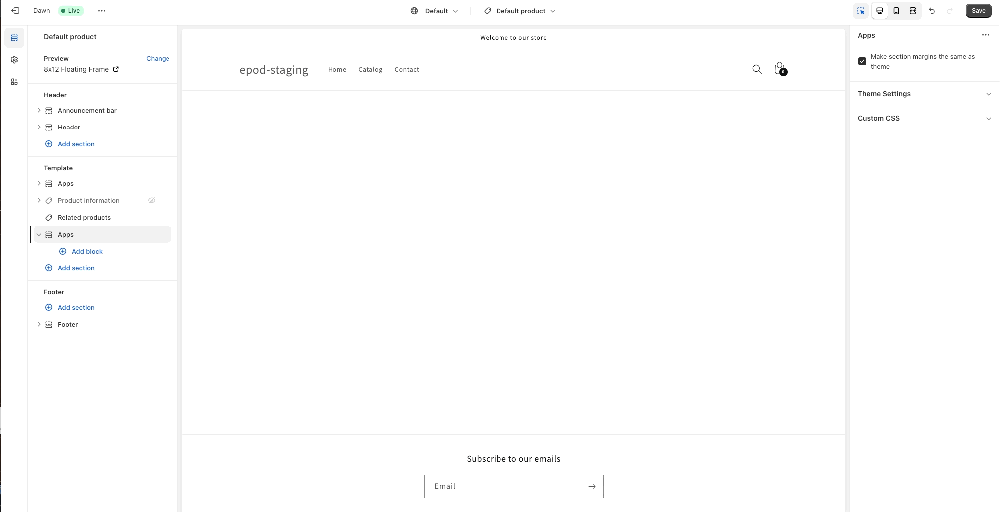
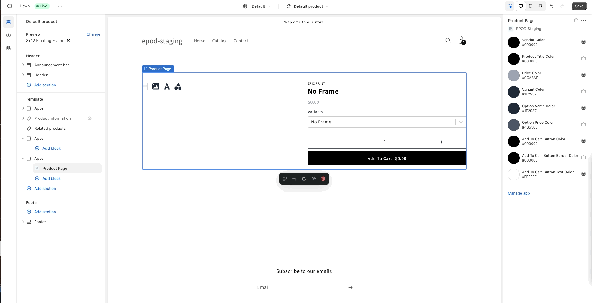
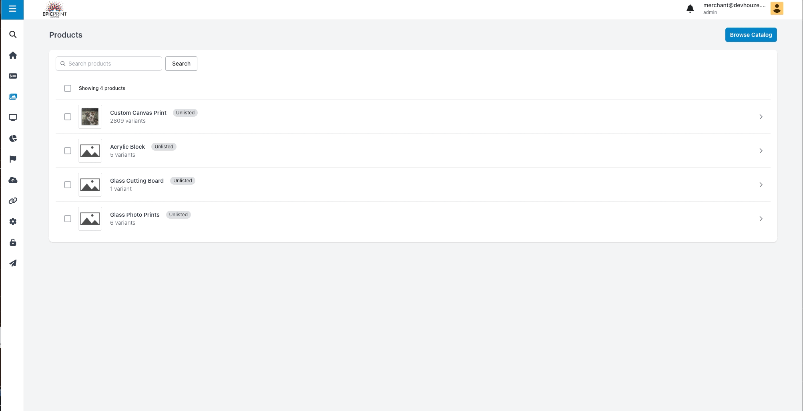
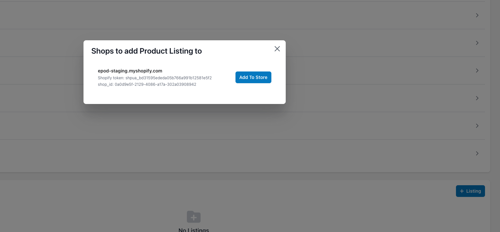
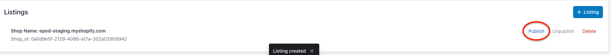
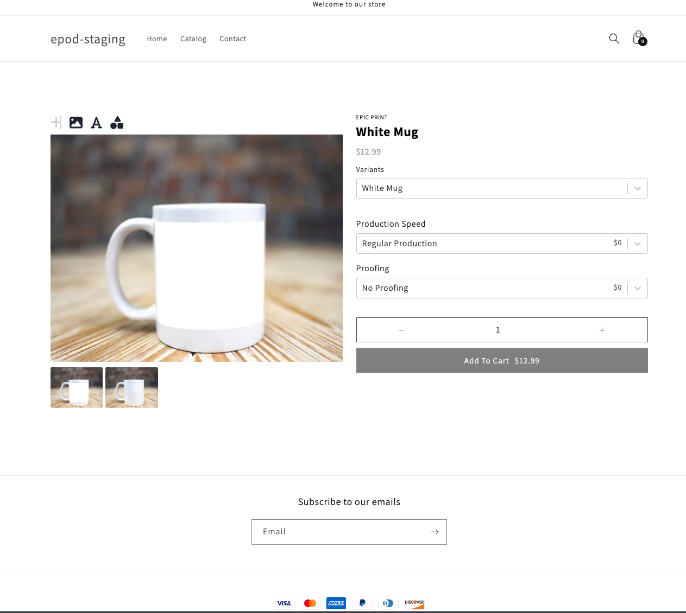

# EPOD Merchant Getting Started Guide

Epic Print on Demand is a Print On Demand Platform to offer Epic Print products for sale.

## Signup up

The fist step in using EPOD is going to be signing up for a Merchant Account. Visit [internal.epicprint.dev/app/merchant](https://internal.epicprint.dev/app/merchant) and click "create an account". Or sign in if you already have a merchant account.

## Installation

After you signup for a merchant account use this link to install EPOD onto your shopify store. **You must be signed in before you can use the install link!**

[Installation Link](https://admin.shopify.com/oauth/install_custom_app?client_id=2c08e9a2b731b436f1b368ae7faf2145&signature=eyJfcmFpbHMiOnsibWVzc2FnZSI6ImV5SmxlSEJwY21WelgyRjBJam94TmprMU5EazBNemN4TENKd1pYSnRZVzVsYm5SZlpHOXRZV2x1SWpvaVpYQnBZeTF3Y21sdWRDMTNhRzlzWlhOaGJHVXViWGx6YUc5d2FXWjVMbU52YlNJc0ltTnNhV1Z1ZEY5cFpDSTZJakpqTURobE9XRXlZamN6TVdJME16Wm1NV0l6TmpoaFpUZG1ZV1l5TVRRMUlpd2ljSFZ5Y0c5elpTSTZJbU4xYzNSdmJWOWhjSEFpTENKdFpYSmphR0Z1ZEY5dmNtZGhibWw2WVhScGIyNWZhV1FpT2pFd016VTFNRFY5IiwiZXhwIjoiMjAyMy0wOS0zMFQxODozOTozMS40NDhaIiwicHVyIjpudWxsfX0%3D--9fd376502acb13905994ca80305502f0664f3e04)

This installation link expires from time to time, so if you have any issues reach out to the Devhouze team for a new link.

### Adding EPOD elements to your Shopify store

After you have successfully installed the app you will be directed to a shopify. You will need to add our App Blocks to your storefront in order to surface EPOD products and Cart to your customers.

To do so follow these steps or [watch our video](./videos/installation.mov)

1. Click customize on the online store tab.
   
2. Select your product page from the dropdown.
   
3. Add the Product Builder App Block to your Product Page.
   
4. Visit the cart page to add the Cart app block
   
5. Enable the Cart Watcher App Embed so that your cart icon displays the correct number of products in the cart.
   

And you are all done with the installation! Next up we will learn how to list a product.

## Adding a Product to your Merchant account

Now that you have EPOD installed on your merchant store, let's select a product form the catalog and list it on our store!

Follow along with these steps, or [watch our video](./videos/list-product.mov)

1. Visit the [Products Page](https://internal.epicprint.dev/app/merchant/products) to select a product to add to your account. Click the Browse Catalog button and then select from the list presented. For this Demo we are going to choose "mug" from the catalog. If you need to go ahead and search for it.
   
2. Click on the product you just added. Here you can manage Title, Description, Variants, and Listings. We are only interested in listing the product here so click on the + Listing button near the bottom.
   
3. Now the last thing to do is to click "publish"
   

That's it! Now your mug product is listed in your shopify store. If you were to view that product on your storefront it should look like this!

