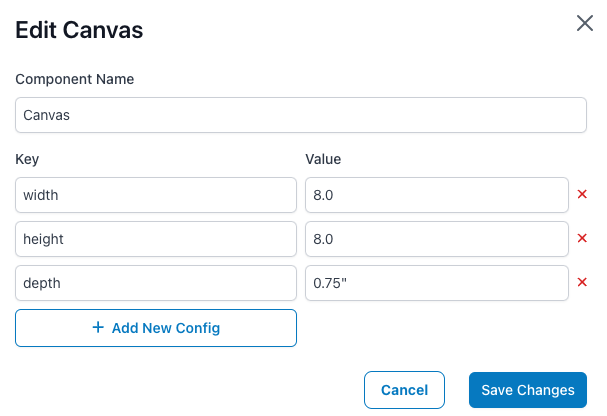

# Catalog Adminitration Guide

The catlog is the list of and configuration for all products that Epic Print offers.

## Products, Add-ons and Options

We offer Products which are the main skus that we offer to merchants and end customers.

Add-ons are products which can only be purchased in addition to a regular product, and they apply to an entire order. A good example of this is Priority Production, which when added on to an order will apply that to the entire cart.

Options are additional customizations that can modify the source product associated with it. A good example of this is changing the canvas depth of a canvas product.

These can all be manipulated or created from the Product page in the catalog admin portal.

## Variants

Variants belong to a parent product and are what end custmers can acutally purchase. Usually a variant specifies the size, color, style, or something else of a product. For example, Custom Canvases are a product, and then every size we offer is a variant for that product.

## Scene Templates

Scene templates are views from which an end customer can configure our product variants. By deafult when a merchant adds a product variant to thier store the default scene is copied from the catalog scene template.

It's important to build scene templates that are decent looking and will work on the majority of cutstomer stores. We expect that most merchants will use our default scene templates for their variants.

## Placements

Placements are defined as

> Areas on a product that can accept a customer design.

this means that the only customer designs that can be accepted will be linked to placements.

Placements accept the following attributes.


### Config values

Each placement can have as many config values as needed. Config values are there to hold the key/values that we want to send to prepress when the image is processed for this placement.

In the screenshot above, if someone where to order this variant, then the data sent to Prepress (switch) would include these key/values in them.

```json
{
  "print_width": "8.0",
  "print_height": "8.0",
  "depth": "0.75\"",
  "size_format": "sml"
}
```

## Components

Components are somewhat similar to placements, but they are defined as

> The physical item that needs to get manufactured when someone purchases this product.

So for example the components of an 8x8 canvas look like this


Comopnents are mainly composed of a list of key/values.

### Config Values

The config values for componenets are what the MIS sytem uses to undersand how to process and produce this variant. So if somone orders our 8x8 variant it MIS will know that it needs to produce a canvas that is 8" wide and 8" high and has a standard depth of 0.75"
